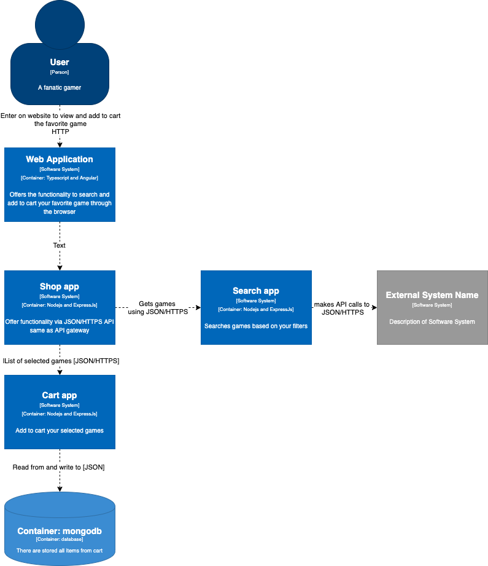

# Shop app

The web application offers the possibility to search for the game you want to buy by filtering the desired platform and the type of game.


# Installation

```sh
$ docker-compose up
```

# Architecture

Context Diagram


Container Diagram



Component Diagram


SOA patterns

- API Gateway - Shop App acts as an api gateway of the system, redirecting client calls to the microservices that are responsible for them.
- Database per service - Each microservice that requires a database has one, even if in this case only the cart App does.
- Service instance per container - Each service instance is deployed in a separate docker container.
